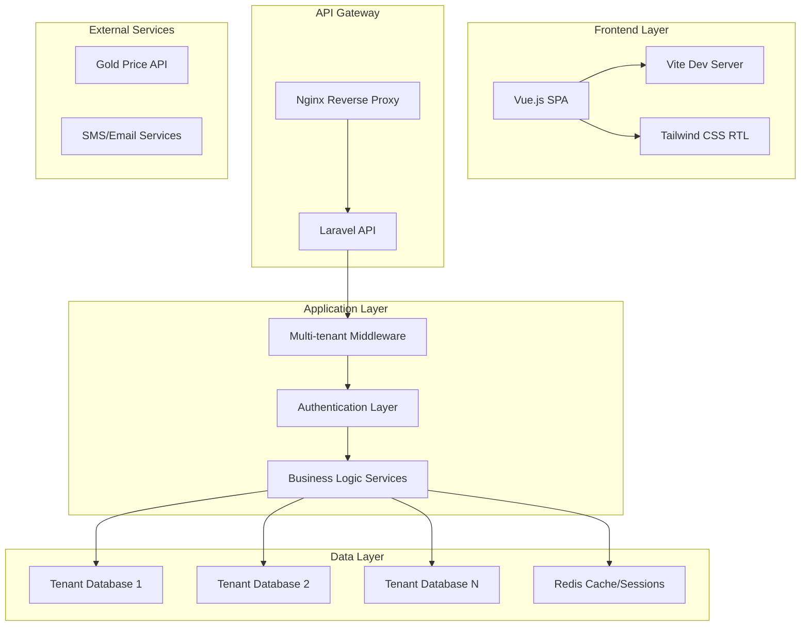

# Design Document

## Overview

The Jewelry SaaS Platform is designed as a multi-tenant Laravel application with Vue.js frontend, providing comprehensive business management tools for Persian-speaking jewelers. The architecture emphasizes security, scalability, and RTL language support while maintaining clean separation of concerns through modular design patterns.

### Key Design Principles

- **Multi-tenant isolation**: Complete data separation using database-per-tenant approach
- **Modular architecture**: Laravel service providers for pluggable functionality
- **RTL-first design**: Persian language and right-to-left layout as primary interface
- **Docker-native**: Fully containerized development and deployment environment
- **Real-time capabilities**: WebSocket integration for live updates and notifications

## Architecture

### High-Level Architecture



### Multi-Tenant Strategy

**Database-per-tenant approach** for maximum isolation:
- Each tenant gets dedicated MySQL database
- Shared application code with tenant context resolution
- Tenant identification via subdomain routing
- Central tenant registry for database connection management

## Components and Interfaces

### Backend Components

#### 1. Multi-Tenant Infrastructure

**TenantResolver Middleware**
```php
class TenantResolver
{
    public function handle($request, Closure $next)
    {
        $tenant = $this->resolveTenantFromSubdomain($request);
        $this->setDatabaseConnection($tenant);
        app()->instance('tenant', $tenant);
        return $next($request);
    }
}
```

**Database Connection Manager**
- Dynamic database connection switching
- Connection pooling for performance
- Automatic migration management per tenant

#### 2. Core Business Services

**InvoiceService**
- Gold price calculation engine
- Multi-currency support
- PDF generation with RTL formatting
- Recurring invoice scheduling

**InventoryService**
- Multi-category product management
- BOM (Bill of Materials) handling
- Stock level monitoring and alerts
- Barcode/QR code generation

**AccountingService**
- Double-entry bookkeeping engine
- Chart of accounts management
- Financial report generation
- Automated journal entry processing

**CustomerService**
- CRM functionality with relationship tracking
- Customer segmentation and grouping
- Credit limit management
- Communication history tracking

#### 3. Security Layer

**Authentication System**
- Laravel Sanctum for API authentication
- Two-factor authentication support
- Session device tracking
- IP whitelisting and geo-fencing

**Authorization Framework**
- Role-based access control (RBAC)
- Custom permission system
- Tenant-level policy enforcement
- Audit logging for all actions

### Frontend Components

#### 1. Vue.js Application Structure

**Main Application Shell**
```javascript
// App.vue - Main application container
// Router configuration with tenant context
// Global state management with Pinia
// RTL layout management
```

**Core Modules**
- Dashboard module with drag-drop widgets
- Invoice management with real-time calculations
- Customer management with advanced search
- Inventory tracking with barcode scanning
- Accounting module with report generation
- Settings and configuration panels

#### 2. RTL and Internationalization

**Language Management**
- Vue i18n for translation management
- Dynamic RTL/LTR layout switching
- Persian/English number formatting
- Date localization support

**UI Components**
- Custom RTL-aware component library
- Tailwind CSS with RTL plugin
- Responsive design for mobile/tablet
- Dark/light theme support

## Data Models

### Core Entities

#### Tenant Model
```php
class Tenant extends Model
{
    protected $fillable = [
        'name', 'subdomain', 'database_name', 
        'status', 'subscription_plan', 'settings'
    ];
    
    public function users() { return $this->hasMany(User::class); }
    public function subscription() { return $this->hasOne(Subscription::class); }
}
```

#### User Model (Tenant-specific)
```php
class User extends Model
{
    protected $fillable = [
        'name', 'email', 'password', 'role_id',
        'permissions', 'last_login', 'two_factor_enabled'
    ];
    
    public function role() { return $this->belongsTo(Role::class); }
    public function sessions() { return $this->hasMany(UserSession::class); }
}
```

#### Invoice Model
```php
class Invoice extends Model
{
    protected $fillable = [
        'invoice_number', 'customer_id', 'type', 'status',
        'subtotal', 'tax_amount', 'total_amount', 'gold_weight',
        'gold_price_per_gram', 'manufacturing_fee', 'profit_margin'
    ];
    
    public function customer() { return $this->belongsTo(Customer::class); }
    public function items() { return $this->hasMany(InvoiceItem::class); }
    public function payments() { return $this->hasMany(Payment::class); }
}
```#### Produ
ct Model
```php
class Product extends Model
{
    protected $fillable = [
        'name', 'sku', 'barcode', 'category_id', 'type',
        'gold_weight', 'stone_weight', 'manufacturing_cost',
        'current_stock', 'minimum_stock', 'unit_price'
    ];
    
    public function category() { return $this->belongsTo(ProductCategory::class); }
    public function bomItems() { return $this->hasMany(BillOfMaterial::class); }
    public function stockMovements() { return $this->hasMany(StockMovement::class); }
}
```

#### Customer Model
```php
class Customer extends Model
{
    protected $fillable = [
        'name', 'phone', 'email', 'address', 'tax_id',
        'customer_group_id', 'credit_limit', 'current_balance',
        'birth_date', 'notes', 'tags'
    ];
    
    public function group() { return $this->belongsTo(CustomerGroup::class); }
    public function invoices() { return $this->hasMany(Invoice::class); }
    public function ledgerEntries() { return $this->hasMany(CustomerLedger::class); }
}
```

#### Accounting Models
```php
class Account extends Model
{
    protected $fillable = [
        'code', 'name', 'type', 'parent_id', 'is_active'
    ];
    
    public function parent() { return $this->belongsTo(Account::class, 'parent_id'); }
    public function children() { return $this->hasMany(Account::class, 'parent_id'); }
    public function journalEntries() { return $this->hasMany(JournalEntry::class); }
}

class JournalEntry extends Model
{
    protected $fillable = [
        'entry_number', 'date', 'description', 'reference',
        'total_debit', 'total_credit', 'status', 'created_by'
    ];
    
    public function details() { return $this->hasMany(JournalEntryDetail::class); }
}
```

### Database Schema Design

**Multi-tenant Database Strategy:**
- Central `tenants` database for tenant management
- Individual tenant databases with identical schema
- Automated migration system for schema updates
- Database naming convention: `tenant_{tenant_id}`

## Error Handling

### Exception Hierarchy

```php
// Base application exception
abstract class JewelryPlatformException extends Exception {}

// Tenant-specific exceptions
class TenantNotFoundException extends JewelryPlatformException {}
class TenantAccessDeniedException extends JewelryPlatformException {}

// Business logic exceptions
class InsufficientStockException extends JewelryPlatformException {}
class InvalidGoldPriceException extends JewelryPlatformException {}
class CreditLimitExceededException extends JewelryPlatformException {}

// Security exceptions
class UnauthorizedAccessException extends JewelryPlatformException {}
class SessionExpiredException extends JewelryPlatformException {}
```

### Error Response Format

```json
{
    "success": false,
    "error": {
        "code": "INSUFFICIENT_STOCK",
        "message": "موجودی کافی نیست",
        "message_en": "Insufficient stock available",
        "details": {
            "product_id": 123,
            "requested": 5,
            "available": 2
        }
    },
    "timestamp": "2024-01-15T10:30:00Z"
}
```

### Logging Strategy

- **Application Logs**: Laravel Log channels with tenant context
- **Audit Logs**: Separate audit trail for sensitive operations
- **Security Logs**: Authentication, authorization, and suspicious activity
- **Performance Logs**: Database queries, API response times
- **Error Tracking**: Integration with error monitoring service

## Testing Strategy

### Testing Pyramid

#### Unit Tests (70%)
- Service layer business logic
- Model relationships and validations
- Utility functions and helpers
- Gold price calculation algorithms
- RTL text formatting functions

#### Integration Tests (20%)
- API endpoint testing with tenant context
- Database operations across tenant boundaries
- External service integrations (Gold price API, SMS)
- Authentication and authorization flows
- Multi-tenant data isolation verification

#### End-to-End Tests (10%)
- Complete user workflows (invoice creation, payment processing)
- Multi-browser RTL layout testing
- Real-time features (WebSocket connections)
- Mobile responsiveness testing
- Performance testing under load

### Docker Test Environment

```yaml
# docker-compose.test.yml
version: '3.8'
services:
  app-test:
    build: .
    environment:
      - APP_ENV=testing
      - DB_CONNECTION=mysql_test
    depends_on:
      - mysql-test
      - redis-test
  
  mysql-test:
    image: mysql:8.0
    environment:
      MYSQL_ROOT_PASSWORD: test_password
      MYSQL_DATABASE: jewelry_platform_test
    tmpfs:
      - /var/lib/mysql  # In-memory for faster tests
  
  redis-test:
    image: redis:7-alpine
```

### Test Data Management

- **Database Seeding**: Realistic jewelry business data
- **Tenant Factories**: Automated tenant creation for testing
- **Multi-language Test Data**: Persian and English content
- **Gold Price Mocking**: Simulated external API responses
- **File Upload Testing**: Invoice PDFs, product images

### Continuous Integration

```yaml
# .github/workflows/test.yml
name: Test Suite
on: [push, pull_request]
jobs:
  test:
    runs-on: ubuntu-latest
    services:
      mysql:
        image: mysql:8.0
        env:
          MYSQL_ROOT_PASSWORD: password
        options: --health-cmd="mysqladmin ping" --health-interval=10s
    steps:
      - uses: actions/checkout@v3
      - name: Setup PHP
        uses: shivammathur/setup-php@v2
        with:
          php-version: 8.2
      - name: Install dependencies
        run: composer install
      - name: Run tests
        run: php artisan test --parallel
      - name: Generate coverage
        run: php artisan test --coverage
```